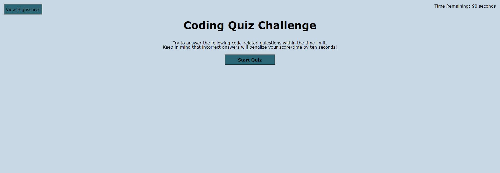
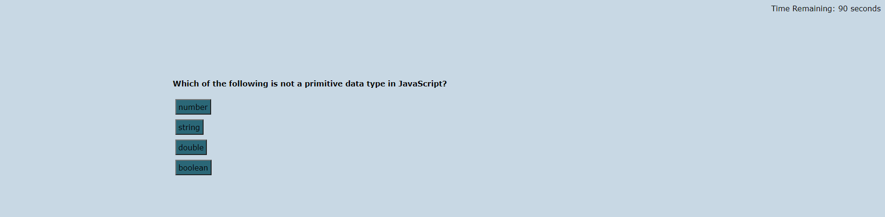
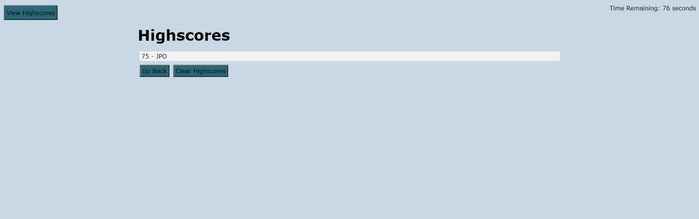

# Web APIs: Code Quiz

## Purpose

The Purpose of this project was to create a timed quiz. When the user answers a question incorrectly they are penalized 10 seconds off of their time. Their final score is the time remaining when they finish the quiz or the time reaches zero. 

Some features of the quiz are:
- The quiz will let the user know if they got the question correct or incorrect.
- The user can input their initials to save their score when they are done. If no initials are input when the score is submitted it will default to saving the score with no initials.
- The user can access the list of highscores at any time outside of taking the quiz.
- The user can refresh the page the highscores will still remain.
- The user can clear the highscores if they desire. 

The site can be found at: https://jpolmon.github.io/CodingQuizHW04/

---
## Appearance

### When visited the site should appear as:  

### The quiz questions will appear as:

### The leaderboard will appear as:

